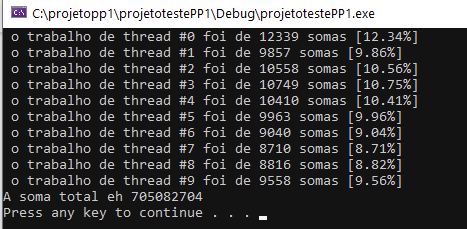

# Fundamentos de programação paralela

## Como compilar
```
gcc -pthread -o 'nome_executavel' programa.c
```

## Uso da biblioteca de Pthread
1. Você deve importar a biblioteca para poder usar os tipos e funções disponibilizados.
```
#include <pthread.h>
```

2. tipo default de thread é o pthread você deve declarar a thread antes de usa-lá.
```
pthread_t tid;
```
3. Para criação de uma thread é usado a função pthread_create, que recebe: endereço de memória de um pthread, NULL, função de thread, parametro para função de thread.
```
pthread_create(&tid,NULL, funcao, &var1)
```

``` vale ressaltar que a função de thread deve ter uma assinatura recebendo um ponteiro pra void e retornando ponteiro para void, a passagem de paramentos é feita  com cast e decasting.```
```
void* funcao_thread (void* args); 
```
4. Cabe ao sistema operacional gerenciar os recursos das threads, por esse motivo devemos esperar o fim de uma thread para recolher o resultado do seu processamento, para esse fim temos a função pthread_join.
```
pthread_join(tid, NULL);
```
<hr>

## Lista 1
Faça um codigo simples no VS que crie 5 threads e execute todas elas imprimindo seu proprio ID de forma a visualizar a desordem das impressoes fazendo com q o codigo principal espere ate que todas as 5 threads terminem.

ps: somente cria UMA funcao thread, nao vale se usar 5 funcoes de thread.  
[Link do código](lista_01.c)

## Lista 2
Faça um código simples no VS que crie 10 threads e um vetor de CEM MIL posicoes, popule o mesmo vetor na thread principal, crie cada uma das 10 threads fazendo com que as mesmas concorram entre si para somar as posicoes do vetor sem repeticoes das posicoes do mesmo, cada thread soh pode somar uma posicao por vez, USE MUTEX. [No video da aula tem praticamente isso feito]

Seu codigo deve, ALEM de expor o resultado final correto, imprimir quantas posicoes de soma cada thread foi responsavel [e eh aqui o problema real :D ]  



[link do código]()

<hr>

## Trabalho 1 
Existem 6 processos nesse problema: 3 processos infectados e 3 processos laboratórios.

Cada um dos infectados vai fazer um remédio e usá-lo [o vírus é altamente mutável então o remédio tem que ser reaplicado a todo momento que for possível].

Para fazer um remédio são necessários : vírus morto, injeção e insumo secreto.

Cada infectado tem 1 dos 3 produtos.

Exemplo: 1 processo infectado tem um suprimento infinito de vírus morto, outro tem de injeção e o último tem de insumo secreto.

Cada laboratório tem um diferente suprimento infinito de 2 dos 3 produtos.
* laboratorio1 tem injeção, vírus morto, laboratorio2 tem injeção e insumo secreto e laboratorio3 tem insumo secreto e vírus morto.

Cada laboratório coloca seus 2 produtos próprios numa mesa em comum a todos infectados a disposição de quem quiser e todos os infectados correm pra pegar os dois que eles precisam pra fazer o remédio e somente renovam quando os SEUS PRÓPRIOS distribuídos forem consumidos. [o lab2 não renova se alguém consumir a injeção do lab1 e o insumo secreto do lab3, por exemplo]


* Como garantir exclusão mutua, sem deadlock, sem starvation, sem busy-wait, sem queimar-processador (while infinito testando constantemente alguma condição sem dormir] e fazendo o seu código ser o mais paralelo possível?

[dica, só vai funcionar com uma mescla de semáforos e mutexes]

a entrada do código será um número que vai ser a quantidade de vezes MÍNIMA que cada thread tem que realizar seu objetivo primordial. [um infectado ou laboratório que atinge o mínimo NÃO para de concorrer com os outros, ele continua se vacinando e o laboratório produzindo]. As threads nao podem se utilizar de qualquer tipo de forma de identificação de qual laboratorio ou qual infectado que esta sendo executado. Tudo deve ser genérico. 


A saída deverá ser o número de vezes que cada thread realizou seu objetivo primordial:
no caso, os infectados irão contabilizar o número de vezes que cada um usou o remédio e os laboratórios o número de vezes que cada um renovou seus estoques:
Exemplo de de execução:

./covid-19 90  [irá executar até todas as threads terem executado seu objetivo PELO MENOS 90 vezes]  
infectado 1: 120  
infectado 2: 100  
infectado 3: 90  
laboratorio 1: 120  
laboratorio 2: 100  
laboratorio 3: 90  

[link do código](trabalho_fppd_marcelo_p_mendes.c)

## Trabalho 2

Na barbearia há X barbeiros, X cadeiras de barbeiro , um sofá de Y lugares, barbearia com Z espaços para eventuais clientes esperarem a sua vez.

Regras a Serem Seguidas:

X cadeiras;  
X barbeiros;  
sala de espera com um sofá de Y lugares;  
o número total de clientes permitidos na barbearia é Z;  
nenhum cliente entrará se a capacidade do local estiver satisfeita;  
se o cliente entrou e tiver lugar no sofá ele se senta, caso contrário ele espera em pé;  
quando um barbeiro está livre para atender, o cliente que está a mais tempo no sofá é atendido e o que está a mais tempo em pé se senta;  
qualquer barbeiro pode aceitar pagamento, mas somente um cliente pode pagar por vez, porque só há uma caixa registradora;  
os barbeiros dividem o seu tempo entre cortar cabelo, receber pagamento e dormir enquanto esperam por um cliente.  

Cada cliente é uma thread, assim como cada barbeiro também o é
[OPCIONAL, 20% a mais na nota] o barbeiro DEVE identificar o ID do cliente que atende e, de forma análoga, o cliente deve saber qual barbeiro o atendeu [você não vai imprimir isso no resultado final, mas deve ter uma linha de debug apontada por você no código para eu descomentar e poder analisar tal comportamento]

Seu programa deve paralelizar tudo isso, de forma a evitar todos os problemas padrões da paralelização clássica recebendo como argumentos X , Y , Z pela linha de comando além de um W que é o número MÍINIMO de clientes que cada barbeiro deve atender.  

Assim como no 1 trabalho, nenhuma thread deve morrer até que TODOS  os barbeiros atinjam o mínimo, ou seja, nenhum barbeiro irá parar de atender nenhum cliente até que todos os barbeiros tenham atendido o mínimo passado como argumento e nada pode  ter comportamento BUSY-WAIT [queimando processador inultimente]  

O código final tem que imprimir exatamente na ordem dos barbeiros o quanto de cliente eles atenderam.

Seu código final NÃO DEVE IMPRIMIR NENHUM DEBUG, ou seja, comentem suas linhas de código de debug MAS DEIXEM ELA NO CÓDIGO para eu analisar.

exemplo:

./barbeiros 1 5 20 10  
barbeiro 0 atendeu 10 clientes

./barbeiros 2 5 20 10  
barbeiro 0 atendeu 15 clientes  
barbeiro 1 atendeu 10 clientes  

[link do código]()
